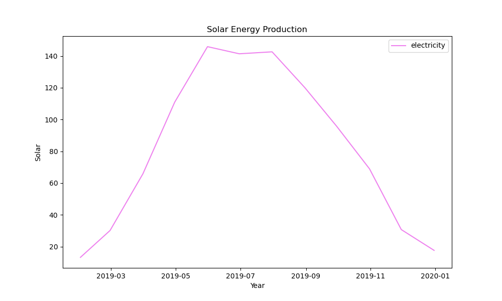

# **Higher Diploma in Computing: Data Analytics**

### **Module: Programming for Data Analytics**
***

#### **Project:**

This project analyses the historical weather data obtained from  [Met Eireann](https://www.met.ie/climate/available-data/historical-data) for five locations across Ireland to get an overview of weather conditions,and their impact on renewable energy sources, particularly wind energy. 

#### **Method overview:**

Data Processing and analysis:

-   Jupyter notebook: open source web application used for python coding in real time, text and visualisations. 

-   Pandas: open-source python library built on top of NumPy used for data manipulation and analysis. 
    -    The CSV datasets were loaded into a pandas dataFrame using pd.read_csv(). The data was cleaned using methods like dropna() to remove missing values.  groupby() and resample()splits data into groups and allowed aggregation of data using mean() etc.
    -    For time-series analysis, the pandas datetime function was used to process dates and times. pd.to_datetime() used to convert string dates into datetime objects. 
   - Data Visualisation: Matplotlib: python library used to create plots to display the data graphically. 

#### Set-up: 

- [Anaconda](https://www.anaconda.com/download) for creating and managing Python environments
- [Visual Studio Code](https://code.visualstudio.com/download) for editing and running the code.

***

#### Summary Statistics: 

-   Malin Head has the highest average and maximum windspeed indicating it is the windiest location. 
-   Belmullet and Malin Head have the highest variability in wind speeds, indicating more turbulent weather conditions.  
-   Shannon Airport and Dublin Airport have more moderate windspeed, with Shannon Airport having the lowest windspeed variability. 

***

#### **Data Visualisation:**

The barplot is used to summarise the dataset graphically. The barplot shows that Malin Head has the highest mean wind speed. 

#### Discussion: 